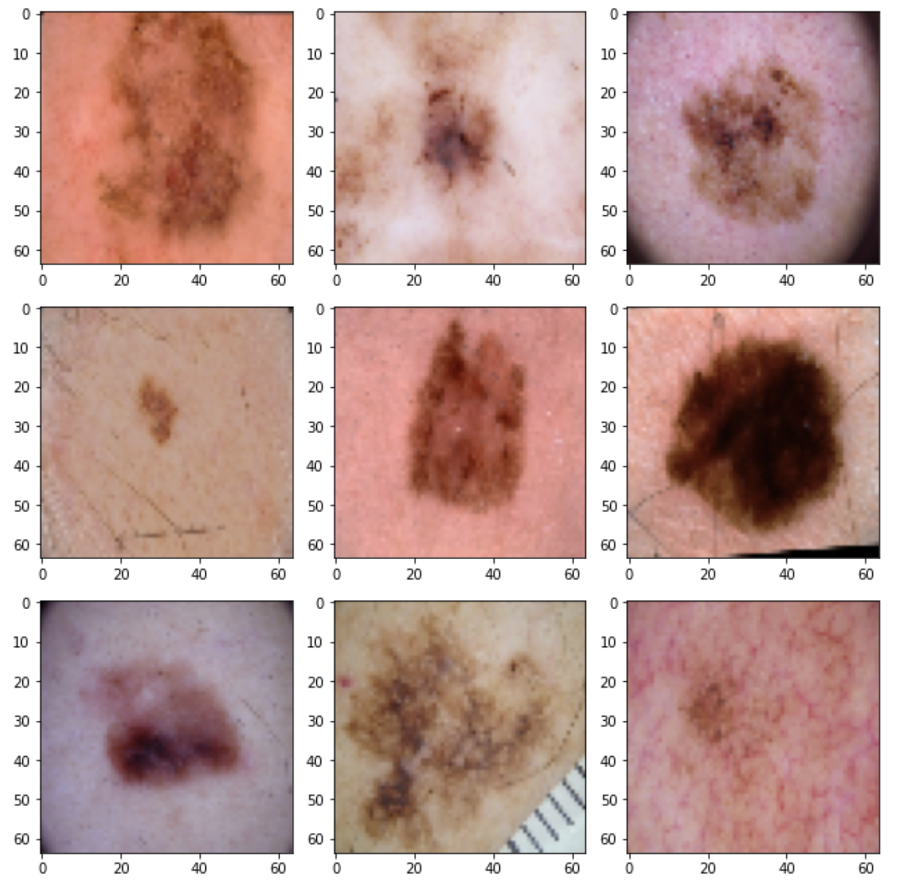
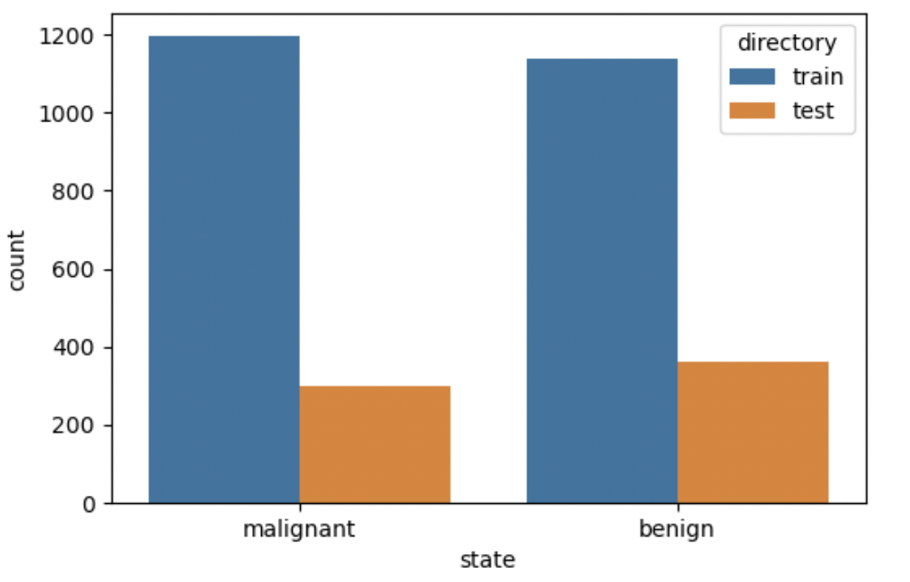
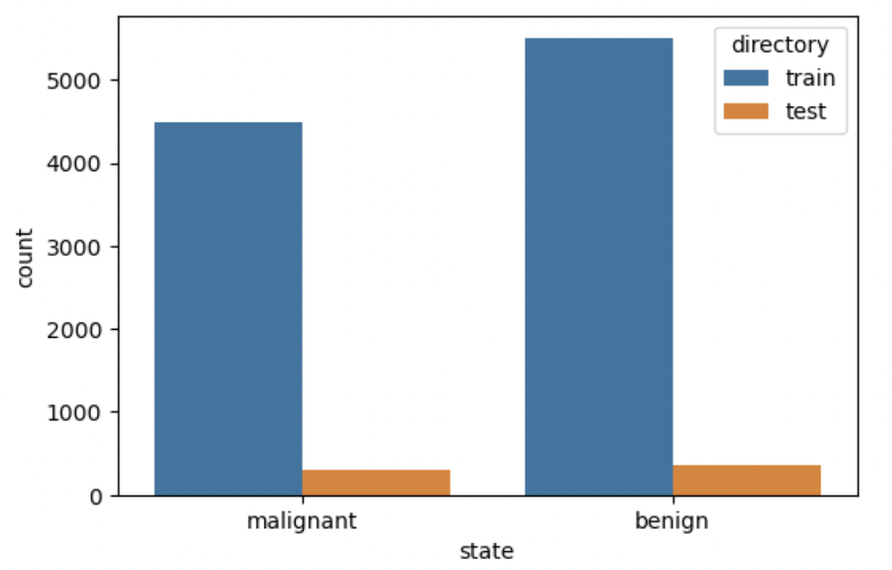
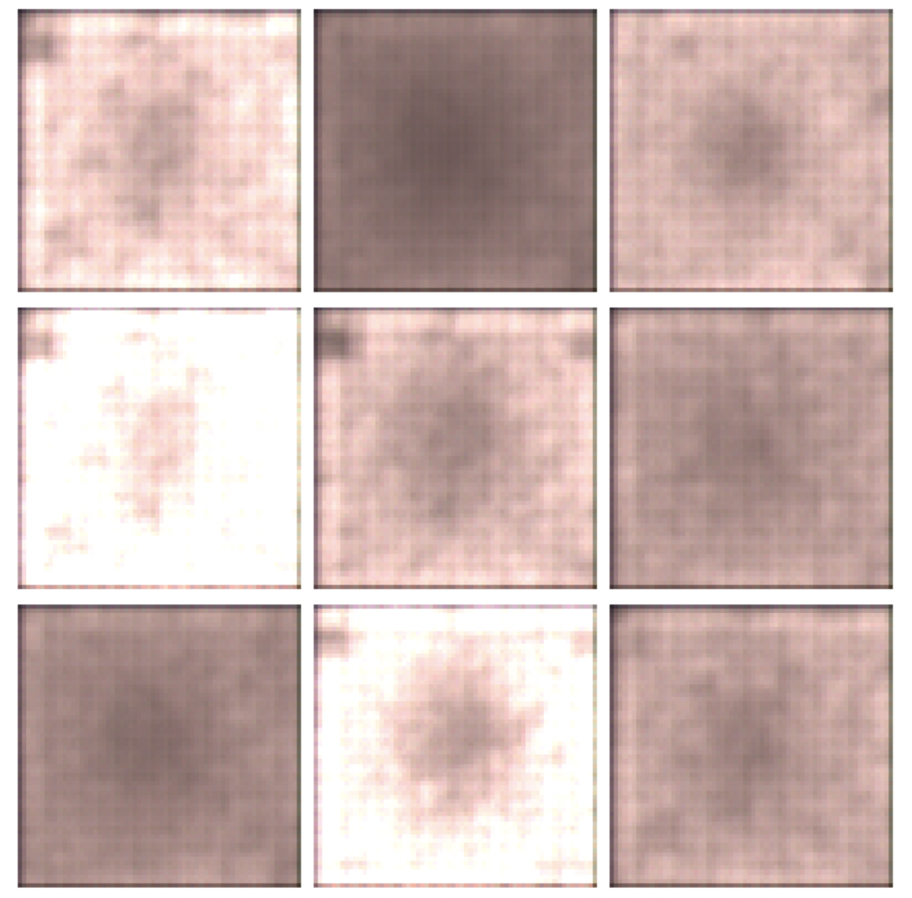
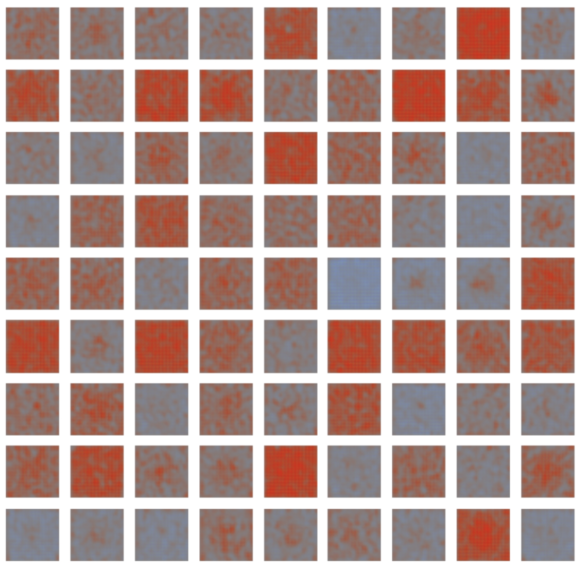

# Melanoma Detection
This will be my academic project for CSE-2039 (Fundamentals of Artificial Intelligence). In this repository, I have worked on building different Convolutional Neural Networks from a couple of research papers. 

The main API used for the project is `TensorFlow`.

## Resources
* Abhishek Thakur's Video on Melanoma Detection with `PyTorch`
    * Link: https://www.youtube.com/watch?v=WaCFd-vL4HA
* Transfer Learning with Ensembles of Deep Neural Networks for Skin Cancer Detection in Imbalanced Data Sets
    * https://arxiv.org/pdf/2103.12068.pdf
* A Smartphone based Application for Skin Cancer Classification Using Deep Learning with Clinical Images and Lesion Information
    * https://arxiv.org/pdf/2104.14353.pdf
* Benchmarking of Lightweight Deep Learning Architectures for Skin Cancer Classification using ISIC 2017 Dataset
    * https://arxiv.org/pdf/2110.12270.pdf

## Dataset
The data for this project is collected from Kaggle. 
* SIIM-ISIC Melanoma Classification
    * Link: https://www.kaggle.com/c/siim-isic-melanoma-classification.
* Skin Cancer: Malignant vs. Benign
    * Link: https://www.kaggle.com/fanconic/skin-cancer-malignant-vs-benign
* Skin Cancer MNIST - HAM10000
    * Link: https://www.kaggle.com/kmader/skin-cancer-mnist-ham10000
    
### Sample Images


    
### Data Distribution

#### Before Augmentation


|Dataset|No. of Images|
|-------|-------------|
|Train|2374|
|Validation|263|
|Test|660|

|Class|Number of Images|Directory|
|-----|----------------|---------|
|Malignant|1197|train|
|Benign|1140|train|
|Malignant|300|test|
|Benign|360|test|

#### After Augmentation

Code:

```python
import Augmentor as ag
p = ag.Pipeline("../data/train/")
p.rotate90(probability=0.5)
p.zoom(probability=0.3, min_factor=0.8, max_factor=1.5)
p.flip_left_right(probability=0.8)
p.flip_top_bottom(probability=0.3)
p.random_brightness(probability=0.3, min_factor=0.3, max_factor=1.2)
p.sample(10000)
```


|Dataset|No. of Images|
|-------|-------------|
|Train|9001|
|Validation|999|
|Test|660|

|Class|Number of Images|Directory|
|-----|----------------|---------|
|Malignant|4497|train|
|Benign|5503|train|
|Malignant|300|test|
|Benign|360|test|

## Evaluation Criterion
Since, this is a medicine related dataset, we must not focus on the accuracy, but on reducing the number of False Negatives. That is, say a person has skin cancer, but we predict that he/she doesn't have cancer. This is dangerous because he/she may lose his life. But, if we predict that the person has skin cancer even though he/she doesn't although it's a mis-classification, it can be prefered more because, he/she will get it tested and a life may be saved.

So, the metric should be metrics like `False_Negative`, `False_Positive`, `Precision` and `Recall` rather than `Accuracy` in this case.

## Results

### 32x32 CNN with no Data Augmentation

#### Architecture
```
Model: "model"
_________________________________________________________________
 Layer (type)                Output Shape              Param #   
=================================================================
 input_1 (InputLayer)        [(None, 32, 32, 3)]       0         
                                                                 
 cnn (CNN)                   (None, 32, 32, 64)        1088      
                                                                 
 max_pooling2d (MaxPooling2D  (None, 16, 16, 64)       0         
 )                                                               
                                                                 
 dropout (Dropout)           (None, 16, 16, 64)        0         
                                                                 
 cnn_1 (CNN)                 (None, 16, 16, 40)        23240     
                                                                 
 max_pooling2d_1 (MaxPooling  (None, 8, 8, 40)         0         
 2D)                                                             
                                                                 
 cnn_2 (CNN)                 (None, 8, 8, 30)          10950     
                                                                 
 max_pooling2d_2 (MaxPooling  (None, 4, 4, 30)         0         
 2D)                                                             
                                                                 
 cnn_3 (CNN)                 (None, 4, 4, 25)          6875      
                                                                 
 max_pooling2d_3 (MaxPooling  (None, 2, 2, 25)         0         
 2D)                                                             
                                                                 
 flatten (Flatten)           (None, 100)               0         
                                                                 
 dense (Dense)               (None, 512)               51712     
                                                                 
 dropout_1 (Dropout)         (None, 512)               0         
                                                                 
 dense_1 (Dense)             (None, 1)                 513       
                                                                 
=================================================================
Total params: 94,378
Trainable params: 94,060
Non-trainable params: 318
_________________________________________________________________
```

#### Train Data
|Metric|Score|
|------|-----|
|loss|0.4670059084892273|
|auc|0.9204818606376648|
|false_negative|516.0|
|false_positives|65.0|
|precision|0.8963317275047302|
|recall|0.5213358402252197|
|accuracy|0.7552654147148132|

#### Validation Data
|Metric|Score|
|------|-----|
|loss|0.6094912886619568|
|auc|0.886875569820404|
|false_negative|79.0|
|false_positives|5.0|
|precision|0.8888888955116272|
|recall|0.3361344635486603|
|accuracy|0.680608332157135|

#### Test Data
|Metric|Score|
|------|-----|
|loss|0.46654874086380005|
|auc|0.9121388792991638|
|false_negative|140.0|
|false_positives|20.0|
|precision|0.8888888955116272|
|recall|0.5333333611488342|
|accuracy|0.7575758099555969|

### 64x64 CNN with no Augmentation
#### Architecture
```
Model: "model"
_________________________________________________________________
 Layer (type)                Output Shape              Param #   
=================================================================
 input_1 (InputLayer)        [(None, 64, 64, 3)]       0         
                                                                 
 cnn (CNN)                   (None, 64, 64, 128)       2176      
                                                                 
 max_pooling2d (MaxPooling2D  (None, 32, 32, 128)      0         
 )                                                               
                                                                 
 dropout (Dropout)           (None, 32, 32, 128)       0         
                                                                 
 cnn_1 (CNN)                 (None, 32, 32, 80)        92560     
                                                                 
 max_pooling2d_1 (MaxPooling  (None, 16, 16, 80)       0         
 2D)                                                             
                                                                 
 cnn_2 (CNN)                 (None, 16, 16, 60)        43500     
                                                                 
 max_pooling2d_2 (MaxPooling  (None, 8, 8, 60)         0         
 2D)                                                             
                                                                 
 cnn_3 (CNN)                 (None, 8, 8, 50)          27250     
                                                                 
 max_pooling2d_3 (MaxPooling  (None, 4, 4, 50)         0         
 2D)                                                             
                                                                 
 flatten (Flatten)           (None, 800)               0         
                                                                 
 dense (Dense)               (None, 512)               410112    
                                                                 
 dropout_1 (Dropout)         (None, 512)               0         
                                                                 
 dense_1 (Dense)             (None, 1)                 513       
                                                                 
=================================================================
Total params: 576,111
Trainable params: 575,475
Non-trainable params: 636
_________________________________________________________________
```

#### Train Data
|Metric|Score|
|------|-----|
|loss|0.7700790166854858|
|auc|0.9124453663825989|
|false_negative|923.0|
|false_positives|4.0|
|precision|0.9748427867889404|
|recall|0.1437847912311554|
|accuracy|0.6095198392868042|

#### Validation Data
|Metric|Score|
|------|-----|
|loss|0.937388002872467|
|auc|0.8764297962188721|
|false_negative|107.0|
|false_positives|0.0|
|precision|1.0|
|recall|0.10084034502506256|
|accuracy|0.5931558609008789|

#### Test Data
|Metric|Score|
|------|-----|
|loss|0.783999502658844|
|auc|0.8971203565597534|
|false_negative|267.0|
|false_positives|1.0|
|precision|0.9705882668495178|
|recall|0.10999999940395355|
|accuracy|0.5939394235610962|

### 128x128 CNN with No Augmentation
#### Architecture
```
Model: "model"
_________________________________________________________________
 Layer (type)                Output Shape              Param #   
=================================================================
 input_1 (InputLayer)        [(None, 32, 32, 3)]       0         
                                                                 
 cnn (CNN)                   (None, 32, 32, 192)       1536      
                                                                 
 max_pooling2d (MaxPooling2D  (None, 16, 16, 192)      0         
 )                                                               
                                                                 
 dropout (Dropout)           (None, 16, 16, 192)       0         
                                                                 
 cnn_1 (CNN)                 (None, 16, 16, 120)       207960    
                                                                 
 max_pooling2d_1 (MaxPooling  (None, 8, 8, 120)        0         
 2D)                                                             
                                                                 
 cnn_2 (CNN)                 (None, 8, 8, 90)          97650     
                                                                 
 max_pooling2d_2 (MaxPooling  (None, 4, 4, 90)         0         
 2D)                                                             
                                                                 
 cnn_3 (CNN)                 (None, 4, 4, 75)          61125     
                                                                 
 max_pooling2d_3 (MaxPooling  (None, 2, 2, 75)         0         
 2D)                                                             
                                                                 
 flatten (Flatten)           (None, 300)               0         
                                                                 
 dense (Dense)               (None, 512)               154112    
                                                                 
 dropout_1 (Dropout)         (None, 512)               0         
                                                                 
 dense_1 (Dense)             (None, 1)                 513       
                                                                 
=================================================================
Total params: 522,896
Trainable params: 521,942
Non-trainable params: 954
_________________________________________________________________
```

#### Train Data
|Metric|Score|
|------|-----|
|loss|0.5062731504440308|
|auc|0.9309614300727844|
|false_negative|602.0|
|false_positives|27.0|
|precision|0.9463221430778503|
|recall|0.44155845046043396|
|accuracy|0.73504638671875|

#### Validation Data
|Metric|Score|
|------|-----|
|loss|0.6643155217170715|
|auc|0.8909897804260254|
|false_negative|86.0|
|false_positives|3.0|
|precision|0.9166666865348816|
|recall|0.27731093764305115|
|accuracy|0.661596953868866|

#### Test Data
|Metric|Score|
|------|-----|
|loss|0.5401652455329895|
|auc|0.9101296067237854|
|false_negative|169.0|
|false_positives|10.0|
|precision|0.9290780425071716|
|recall|0.43666666746139526|
|accuracy|0.728787899017334|

### 32x32 with Augmented Data
#### Architecture
```
Model: "model"
_________________________________________________________________
 Layer (type)                Output Shape              Param #   
=================================================================
 input_1 (InputLayer)        [(None, 32, 32, 3)]       0         
                                                                 
 cnn (CNN)                   (None, 32, 32, 64)        1088      
                                                                 
 max_pooling2d (MaxPooling2D  (None, 16, 16, 64)       0         
 )                                                               
                                                                 
 dropout (Dropout)           (None, 16, 16, 64)        0         
                                                                 
 cnn_1 (CNN)                 (None, 16, 16, 40)        23240     
                                                                 
 max_pooling2d_1 (MaxPooling  (None, 8, 8, 40)         0         
 2D)                                                             
                                                                 
 cnn_2 (CNN)                 (None, 8, 8, 30)          10950     
                                                                 
 max_pooling2d_2 (MaxPooling  (None, 4, 4, 30)         0         
 2D)                                                             
                                                                 
 cnn_3 (CNN)                 (None, 4, 4, 25)          6875      
                                                                 
 max_pooling2d_3 (MaxPooling  (None, 2, 2, 25)         0         
 2D)                                                             
                                                                 
 flatten (Flatten)           (None, 100)               0         
                                                                 
 dense (Dense)               (None, 512)               51712     
                                                                 
 dropout_1 (Dropout)         (None, 512)               0         
                                                                 
 dense_1 (Dense)             (None, 1)                 513       
                                                                 
=================================================================
Total params: 94,378
Trainable params: 94,060
Non-trainable params: 318
_________________________________________________________________
```

CNN is a utility class which has a covolutional layer and a batch normalization layer.

```python
class CNN(layers.Layer):
    def __init__(self, filters, kernel_size, strides, padding):
        super(CNN, self).__init__()
        self.conv = layers.Conv2D(
            filters=filters, 
            kernel_size=kernel_size,
            strides=strides, 
            padding=padding, 
            activation='relu'
        )
        self.bn = layers.BatchNormalization()
    
    def call(self, x, training=False):
        x = self.conv(x)
        x = self.bn(x)
        return tf.nn.relu(x)
```

#### Train Data
|Metric|Score|
|------|-----|
|loss|0.37595465779304504|
|auc|0.935274600982666|
|false_negative|1547.0|
|false_positives|242.0|
|precision|0.9117754697799683|
|recall|0.6178359985351562|
|accuracy|0.80124431848526|

#### Validation Data
|Metric|Score|
|------|-----|
|loss|0.5271267294883728|
|auc|0.8663373589515686|
|false_negative|257.0|
|false_positives|35.0|
|precision|0.8458150625228882|
|recall|0.4276169538497925|
|accuracy|0.7077077031135559|

#### Test Data
|Metric|Score|
|------|-----|
|loss|0.4034781754016876|
|auc|0.9088425636291504|
|false_negative|99.0|
|false_positives|32.0|
|precision|0.8626609444618225|
|recall|0.6700000166893005|
|accuracy|0.8015151619911194|

### 64x64 with Augmented Data
#### Architecture
```
Model: "model"
_________________________________________________________________
 Layer (type)                Output Shape              Param #   
=================================================================
 input_1 (InputLayer)        [(None, 64, 64, 3)]       0         
                                                                 
 cnn (CNN)                   (None, 64, 64, 128)       2176      
                                                                 
 max_pooling2d (MaxPooling2D  (None, 32, 32, 128)      0         
 )                                                               
                                                                 
 dropout (Dropout)           (None, 32, 32, 128)       0         
                                                                 
 cnn_1 (CNN)                 (None, 32, 32, 80)        92560     
                                                                 
 max_pooling2d_1 (MaxPooling  (None, 16, 16, 80)       0         
 2D)                                                             
                                                                 
 cnn_2 (CNN)                 (None, 16, 16, 60)        43500     
                                                                 
 max_pooling2d_2 (MaxPooling  (None, 8, 8, 60)         0         
 2D)                                                             
                                                                 
 cnn_3 (CNN)                 (None, 8, 8, 50)          27250     
                                                                 
 max_pooling2d_3 (MaxPooling  (None, 4, 4, 50)         0         
 2D)                                                             
                                                                 
 flatten (Flatten)           (None, 800)               0         
                                                                 
 dense (Dense)               (None, 512)               410112    
                                                                 
 dropout_1 (Dropout)         (None, 512)               0         
                                                                 
 dense_1 (Dense)             (None, 1)                 513       
                                                                 
=================================================================
Total params: 576,111
Trainable params: 575,475
Non-trainable params: 636
_________________________________________________________________
```

#### Train Data
|Metric|Score|
|------|-----|
|loss|0.3086279034614563|
|auc|0.9400833249092102|
|false_negative|698.0|
|false_positives|588.0|
|precision|0.8506856560707092|
|recall|0.8275691866874695|
|accuracy|0.8571269512176514|

#### Validation Data
|Metric|Score|
|------|-----|
|loss|0.39539089798927307|
|auc|0.8995059728622437|
|false_negative|131.0|
|false_positives|80.0|
|precision|0.7989949584007263|
|recall|0.7082405686378479|
|accuracy|0.7887887954711914|

#### Test Data
|Metric|Score|
|------|-----|
|loss|0.3531557321548462|
|auc|0.9238147735595703|
|false_negative|29.0|
|false_positives|72.0|
|precision|0.7900875210762024|
|recall|0.9033333659172058|
|accuracy|0.846969723701477|

### Transfer Learning on Augmented Data
#### Architecture
```
Model: "model"
_________________________________________________________________
 Layer (type)                Output Shape              Param #   
=================================================================
 input_2 (InputLayer)        [(None, 64, 64, 3)]       0         
                                                                 
 resnet101v2 (Functional)    (None, None, None, 2048)  42626560  
                                                                 
 global_average_pooling2d (G  (None, 2048)             0         
 lobalAveragePooling2D)                                          
                                                                 
 dense (Dense)               (None, 2)                 4098      
                                                                 
=================================================================
Total params: 42,630,658
Trainable params: 42,532,994
Non-trainable params: 97,664
_________________________________________________________________
```

#### Train Data
|Metric|Score|
|------|-----|
|loss|0.006930578034371138|
|auc|0.9999805688858032|
|false_negative|4.0|
|false_positives|4.0|
|precision|0.9995555877685547|
|recall|0.9995555877685547|
|accuracy|0.9995555877685547|

#### Validation Data
|Metric|Score|
|------|-----|
|loss|0.656663715839386|
|auc|0.8930051922798157|
|false_negative|179.0|
|false_positives|179.0|
|precision|0.8208208084106445|
|recall|0.8208208084106445|
|accuracy|0.8208208084106445|

#### Test Data
|Metric|Score|
|------|-----|
|loss|0.4733511507511139|
|auc|0.9354085922241211|
|false_negative|80.0|
|false_positives|80.0|
|precision|0.8787879347801208|
|recall|0.8787879347801208|
|accuracy|0.8787879347801208|

Interesting how, precision, recall and accuracy are equal for all the datasets respectively.

## Attempts which where unsuccessful for Augmentation
We thought we should augment the images either by using Augmentation and Albumation libraries or generating new ones. We became over-ambitious just and chose the latter. Just to get unsuccessful.😅

### Variational Autoencoders


### Generative Adversarial Networks


## Frameworks Used
1. TensorFlow
2. FastAPI
3. Augmentor
4. NumPy
5. Pandas
6. Matplotlib
7. PIL
8. uvicorn
